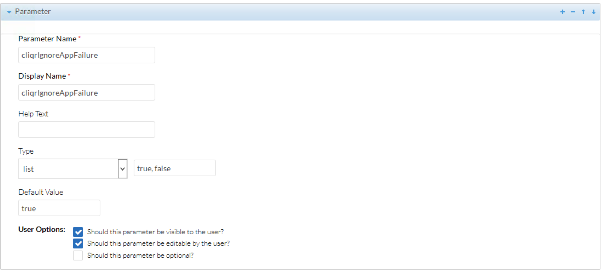
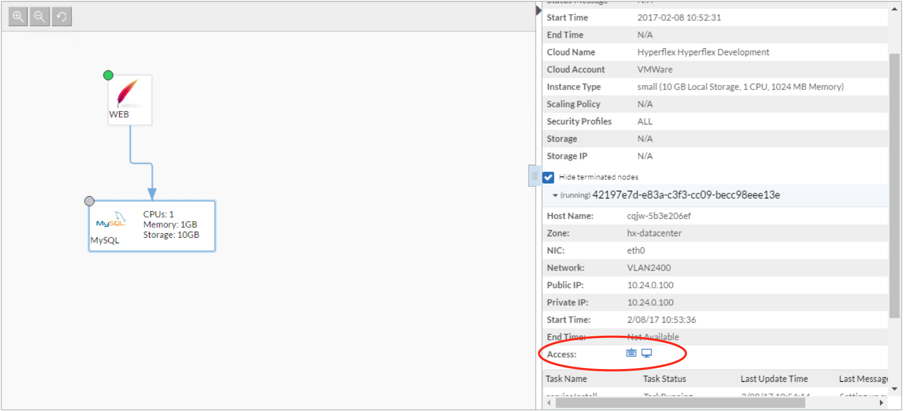
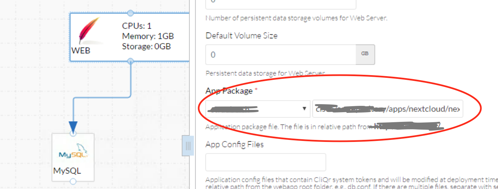
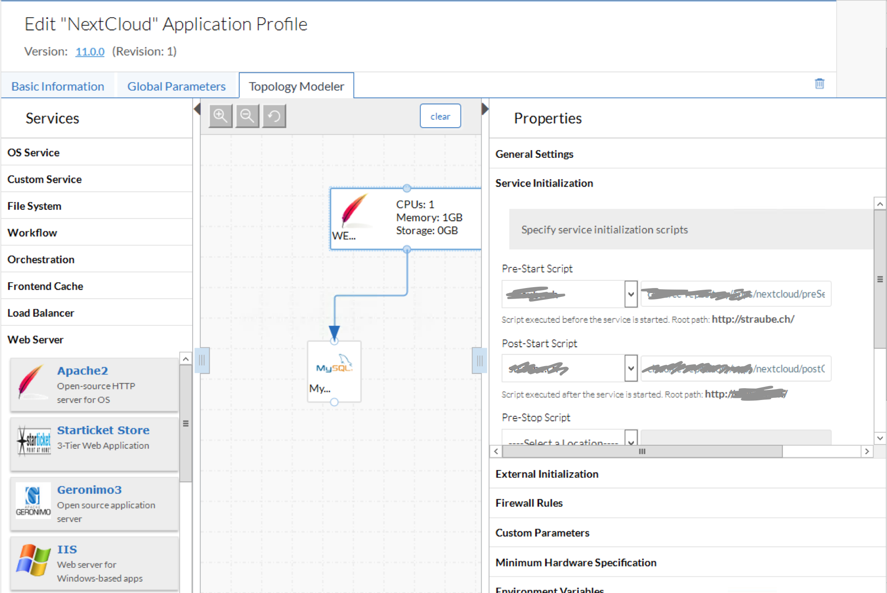
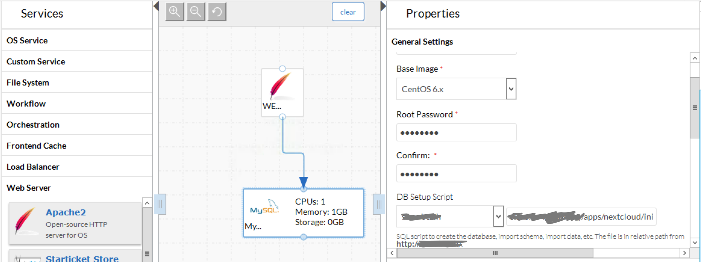
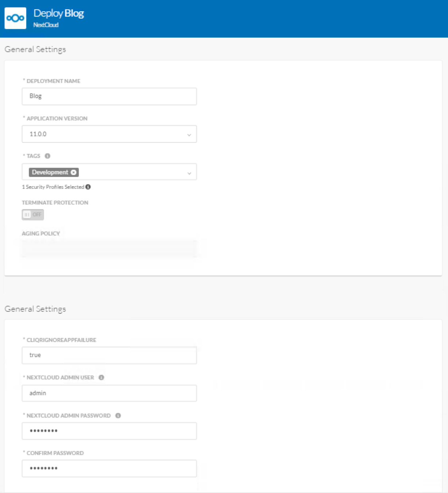
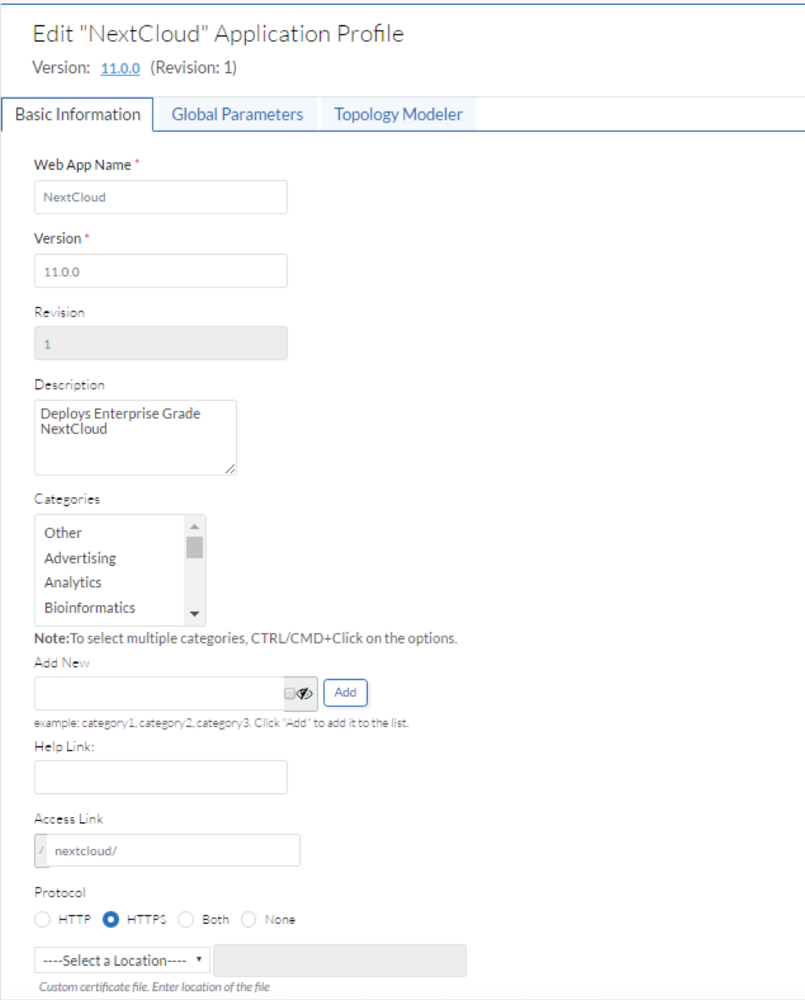
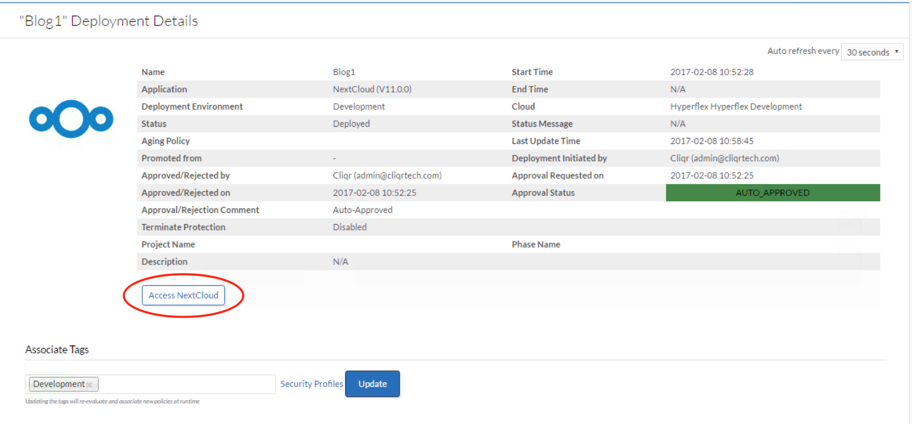
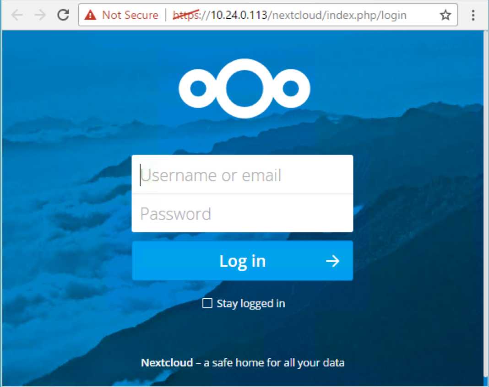

# Building Application Profiles in CloudCenter

## Building your first Application
We will explore the basic principle of creating a custom Application Profile to deploy a simple application called "NextCloud" based on [this](https://nextcloud.com) 

We do assume that your CloudCenter environment is already setup and that you're able to deploy the built-in services to at least one target cloud environment.
After 8 Steps your application will be modeled and ready for deployment, although we recommend for production some additional tweaks add security.

### Step 1: Top-Down Modeling 
As I'm writing here on how I modeled the NextCloud Application I've chosen a more Top-Down modeling approach. However, building the application and services was performed using a bottom-up aproach with many deployments and errors. So we do here some mixture of both approaches, as I think this is helpful. Especially if you're following these steps to build you own application profile.

First we check the documenation of NextCloud in regards of the deployment requirements. Althought there are a couple of options, we settled down on the following ones in **bold**:

- OS: Red Hat Enterprise Linux 7 / Ubuntu 16.04 LTS recommended, Linux (Debian 7, SUSE Linux Enterprise Server 11 SP3 & 12, Red Hat Enterprise Linux/**CentOS 6.5** and 7 (7 is 64-bit only), Ubuntu 14.04 LTS, 16.04 LTS)
- Memory: 128MB to **512MB**
- Dedictaed Web server: **Apache 2 (mod_php, php-fpm)** or Nginx (php-fpm)
- Dedicated Databases: **MySQL/MariaDB 5.5+** ; PostgreSQL; Oracle 11g 
- PHP 5.6 + required

For CloudCenter we do translate this into an N-Tier Application Profile with 2 Tiers:

- Web Tier, where we use the existing apache service
- Database Tier, where we use the existing MySQL Service

Good News, after careful checking I figured out that we don't need to create any new images or services. Less work and reusing existing images is according to best practices!
But do the existing WebServer- and DataBase-Versions, modules and libraries in these images, fit the requirments? Let's find out!

### Step 2:Check Requirements and start an empty deployment
If you're working the first time with a service it might be difficult to understand the detailed configuration and setup. Hence deploying an empty service without and customization gives you an easy way to build and test your deployment script.

To tell CloudCenter to keep the application also in the case of a failure, we can add a single global parameter (can be visible to the enduser, but is not required to). On the "Global Parameter" tab we can add the parameter ==cliqrIgnoreAppFailuer=True==.

During the development phase I encurage you to do this to see where things got wrong. While speaking of things going wrong, make sure your scripts do some sort of extensive logging - maybe as well based on a global parameter which is passed as an envrionment variable to your application stacks. But this is just an idea...

Now let's build a skeleton of our app. Draging an Apache Webserver and a MySQL Database into the topology. Then draw an arrow from the web server to the database. This will tell Cloudcenter the correct dependency - the MySQL DB must be ready before we start the web service. 

With that - You're ready to hit the first deployment.

### Step 3:Logging In, Check Version, Test first modifications
CloudCenter makes it very easy to access your deployed machines regardless of their physical location.

** Apache Web Server **  
All required modules are installed, however the php version is outdated. So one of the first steps we have to fix is updating php. As in our setup the apache webserver is based on a CentOs, the corresponding script is specific to the linux distribution used. More advanced shell scripters can overcome this, however this not scope of Cloudcenter nor this blog.

### Step 4:Modifing Apache Web Service using a script

The Script for adjusting the WebService to the NextCloud requirements is easy, and we do some additional steps as well:

- Source the CloudCenter environment to access envrionment variables and other information
- Removing old php version from service
- add new Repo required for PHP 5.6 and install the required packages
- creating the required directories for NextCloud according to the documentation
- Let's add an http redirect to the https version of the site, as we only want to enable https access

In the Properties Section of the apache webserver we provide the basic information, as well we can directly upload all required application files from a zip package.

For the successful installation of the application package I needed to adjust some things on the webserver:

- Source the CloudCenter environment to access envrionment variables and other information
- Removing old php version from service
- add new Repo required for PHP 5.6 and install the required packages
- creating the required directories for NextCloud according to the documentation
- Let's add an http redirect to the https version of the site, as we only want to enable https access

We end up with the following preServiceInit.sh script.

	#!/bin/bash
	# Source the Cloudcenter user env file to onboard C3 specifc 	vars
	source /usr/local/cliqr/etc/userenv

	echo "Remove old PHP packages" > /var/log/	nextcloud_installer.log
	# Remove old PHP packages
	yum remove php.x86_64 php-cli.x86_64 php-common.x86_64 php-	gd.x86_64 php-ldap.x86_64 php-mbstring.x86_64 php-mcrypt.x86_64 	php-mysql.x86_64 php-pdo.x86_64 -y >> /var/log/	owncloud_installer.log

	echo "configure new Repo" >> /var/log/nextcloud_installer.log
	# Configuring new repo for PHP55
	rpm -Uvh http://mirror.webtatic.com/yum/el6/latest.rpm

	echo "Install PHP 5.6 and packages" >> /var/log/	nextcloud_installer.log
	# Installing new PHP packages for owncloud
	yum install -y php56w php56w-mysql php56w-xml php56w-gd >> /var/log/nextcloud_installer.log
	yum install -y php56w-mbstring >> /var/log/nextcloud_installer.log
	yum install -y php56w-posix >> /var/log/nextcloud_installer.log

	echo "Creating Directories" >> /var/log/nextcloud_installer.log
	# Creating ownCloud data directory, assign ownership and permissions 
	mkdir -p /var/nextcloud_data 
	chown -R apache:apache /var/nextcloud_data/
	chmod -R 755 /var/nextcloud_data

	echo "Add http to https redirect" >> /var/log/nextcloud_installer.log
	# Create a new VirtualHost in the default virtual host configuration file and enable HTTPS redirection
	echo -e "<VirtualHost *:80>\n    Redirect permanent / https://$CliqrTier_WEB_PUBLIC_IP/nextcloud\n</VirtualHost>" >> /etc/httpd/sites-enabled/default-ssl

This is a one-time action which needs to be done upon deployment. After re-visiting the lifecycle script sections, I think best is to add this script to the **"Pre-Start-Script"** section of the apache webserver. This will ensure an execution when the service is beeing deployed.

### Step 5:Configuring the DB
As the MySQL Service is satisfying all requirments out of the box, I only have to create the root password and the initial DB schema based on the NextCloud installation steps. The SQL script can be passed directly to the service.

	CREATE DATABASE IF NOT EXISTS cloud;
	CREATE USER 'nextcloud'@'%' IDENTIFIED BY 'nextpassword';
	GRANT ALL PRIVILEGES ON cloud.* TO 'nextcloud'@'%';

Please note that in this Application Profile the DB user, password and name are hardcoded in the scripts. They can be easily configured on the application level and be passed with environment variables.

 

### Step 6:Configuring NextCloud

With that, we have the application deployed, however, the application is not yet configured. As we don't want the user to see an initial confiuration dialog  where he has to enter db server, users etc, we're going to pre-configure the Application. CloudCenter has already the majority of required information such as IP addresses of the hosts. And the missing information we can add easily as application parameters to the profile and ask the user for input before the deployment.  

 

Hence we're adding the folling parameters in the application model, at the same place we added the CliqrIgnoreAppFailure:

- Admin User Name, named as NEXTCLOUD\_ADMIN\_USER
- Admin User Password, named as NEXTCLOUD\_ADMIN\_PASS

CloudCenter will inject all parameters and some additional information as environment variables. We can easily pick them up in our shell scripts.
The most important additional variable is the **CliqrTier\_MySQL\_PUBLIC\_IP**, which includes the IP of the SQL Server. There is a naming convention, so we have to keep an eye on the tier configuration in the application model (General Settings / Name).

Please note that we still left some usernames/passwords in the script hardcoded. This is not best practice and we strongly recommend to also make the application profile specific. 

postConfig.sh

	#!/bin/bash
	# Source the Cloudcenter user env file to onboard C3 specifc vars
	echo "Running PostConfig.sh" >> /var/log/nextcloud_installer.log

	echo "Restart Apache" >> /var/log/nextcloud_installer.log
	sudo service httpd restart
	source /usr/local/cliqr/etc/userenv

	# Referencing DB credentials and target IPs
	export NEXTCLOUD_DB_USER=nextcloud
	export NEXTCLOUD_DB_PASS=nextpassword
	export NEXTCLOUD_DB_NAME=cloud
	export NEXTCLOUD_DB_HOST=$CliqrTier_MySQL_PUBLIC_IP

	# Run first time configuration 
	cd /var/www/nextcloud
	sudo -u apache php occ  maintenance:install --database "mysql" --database-name $NEXTCLOUD_DB_NAME  --database-user $NEXTCLOUD_DB_USER --database-pass $NEXTCLOUD_DB_PASS --admin-user $NEXTCLOUD_ADMIN_USER --admin-pass $NEXTCLOUD_ADMIN_PASS --database-host $NEXTCLOUD_DB_HOST --data-dir "/var/nextcloud_data" >> /var/log/nextcloud_installer.log

	source /usr/local/cliqr/etc/userenv
	export NEXTCLOUD_DB_HOST $CliqrTier_MySQL_PUBLIC_IP

	# Wait before accessing config.php as it won't be immediately ready after first configuration 
	sleep 5

	sudo cp /var/www/nextcloud/config/config.php /var/www/nextcloud/config/config.php.bck
	sudo sed -i s/localhost/$CliqrTier_WEB_PUBLIC_IP/g /var/www/nextcloud/config/config.php

This script we add in the section **"Service Initialization" - "Post-Start Script"**

### Step 7:adding a digital certificat

Let's add a self signed certificate to the webserver with the correct hostname. We can easily do that in such a way...

nodeInit.sh

	#!/bin/bash

	# Declare variables for certificate gen
	export CERT_DIR="/usr/local/osmosix/cert"
	export COUNTRY="CH"
	export STATE="ZH"
	export CITY="Zurich"
	export ORG="CECLABS"
	export ORG_UNIT="Sales"
	export COMMON_NAME="nextcloud.cisco.com"

	# Prepare certificates for HTTPS
	sudo mkdir -p $CERT_DIR
	sudo openssl req -nodes -newkey rsa:2048 -keyout $CERT_DIR/private.key -out $CERT_DIR/CSR.csr -subj "/C=$COUNTRY/ST=$STATE/L=$CITY/O=$ORG/OU=$ORG_UNIT/CN=$COMMON_NAME"
	sudo openssl rsa -in $CERT_DIR/private.key -out $CERT_DIR/vm.cliqr.com.key
	sudo openssl x509 -in $CERT_DIR/CSR.csr -out $CERT_DIR/vm.cliqr.com.cert -req -signkey $CERT_DIR/vm.cliqr.com.key
	sudo cp $CERT_DIR/vm.cliqr.com.cert $CERT_DIR/vm.cliqr.com.crt

We add the script under **"Node Initialization & Clean Up" - "Initialization script"**

###Step 8: Make it look nice
Adding a custom logo, set the correct Description and Version is the last step we have to do. This is done through the "Basic Information" Section in the application model.

 

### Run a test
So, by now all should be ready and we can deploy the application through CloudCenter. If all wen't well, the deployments are on green and you can access the app through the browser.

 
 

### Conclusion
CloudCenter offers a flexible way to standardize your application deployments. On top of that, once the application deployment has been integrated with CloudCenter you get the freedom of deploying your application in multiple destionation. We take off the worries of cloud specific implemenations and let you concentrate on the deployment of your applications.

